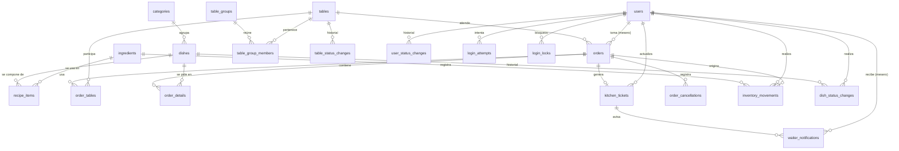

# Gran Parrillada Timbó — Backend (API REST)

API REST del sistema de gestión de pedidos, cocina e inventario de **Gran Parrillada Timbó**, restaurante de parrillas de 30 mesas. Proyecto del curso *Proyecto Tecnológico* (ISIL, NRC 3710), desarrollado con Scrum.

Hoy el restaurante registra los pedidos en un sistema digital y las áreas reciben tickets, pero las modificaciones pueden comunicarse de forma verbal, el estado de las comandas no se sigue y los ingredientes no se descuentan a partir de los pedidos (el inventario se lleva en un kardex). Este sistema busca centralizar los pedidos con sus observaciones, dar seguimiento a las comandas y descontar los ingredientes según la receta de cada plato.

- Frontend: https://github.com/Isai-Arellano-Koo/system_gran_parrillada_timbo_frontend
- Tablero Scrum (Trello): https://trello.com/b/8duBXs5H/project-gran-parrillada-timbo
- Diseños (Figma): https://www.figma.com/design/HFS3KQvvDFlRI30mvj2E5v/Gran-Parrillada-Timbo?node-id=2-2
- API desplegada (Railway): https://systemgranparrilladatimbobackend-production.up.railway.app/

## Contenido

1. [Qué hace el sistema](#qué-hace-el-sistema)
2. [Alcance por sprint e historias](#alcance-por-sprint)
3. [Tecnologías](#tecnologías)
4. [Instalación y ejecución local](#instalación-y-ejecución-local)
5. [Variables de entorno y scripts](#variables-de-entorno)
6. [Roles](#roles)
7. [Endpoints](#endpoints)
8. [Reglas de negocio](#reglas-de-negocio)
9. [Modelo de datos](#modelo-de-datos)
10. [Actualizaciones en tiempo real](#actualizaciones-en-tiempo-real)
11. [Seguridad, pruebas y despliegue](#seguridad)
12. [Decisiones, dificultades y pendientes](#por-qué-lo-hicimos-así)

## Qué hace el sistema

- **Usuarios y accesos:** registro de colaboradores con rol, confirmación de correo, inicio de sesión con correo o usuario, bloqueo temporal por intentos fallidos y recuperación de contraseña.
- **Carta:** categorías, platos con precio y recetas (ingredientes y cantidades por plato).
- **Inventario:** stock inicial y entradas, ajustes, historial de movimientos con filtros, alertas de stock mínimo y revisión de mermas.
- **Pedidos:** tres modalidades de atención (**mesa**, **delivery** y **para llevar**), con validación de stock, confirmación, platos extra, pago, cierre, cancelación y devolución de platos.
- **Mesas:** habilitar o inhabilitar mesas con motivo, agrupar mesas sin abrir pedidos y unir o separar mesas con pedido.
- **Cocina:** comandas con el estado de la comanda y de cada plato, con el nombre del mesero y la fecha y hora del pedido.
- **Notificaciones y tiempo real:** aviso al mesero cuando un plato queda listo y actualización automática de las pantallas sin recargar.
- **Reportes de consulta:** historial de pedidos, historial de cambios de estado de usuarios, platos y mesas, y platos vendidos por rango de fechas.

## Alcance por sprint

| Sprint | Historias | Funcionalidad |
|---|---|---|
| Sprint 1 | HU16, HU01, HU02, HU03 | Registro de usuarios por rol, inicio de sesión, ingredientes, stock inicial y entradas |
| Sprint 2 | Historias del Sprint Backlog entre HU04 y HU15, y mejoras aprobadas | Carta (platos, categorías y recetas), flujo completo del pedido, cancelaciones, movimientos y alertas de stock; control de intentos fallidos de login, motivo de cambio de estado de usuarios e ingredientes sin modificar stock |
| Mejoras posteriores | Funcionalidades adicionales al backlog inicial | Delivery y pedidos para llevar, unir y separar mesas, habilitar mesas, notificaciones y tiempo real, historial y platos vendidos, gestión de mermas y devoluciones |

Qué historias entraron en cada sprint y su estado de validación se registran en el tablero de Trello. A continuación, dónde vive cada historia en el código.

### Historias y dónde están en el código

| HU | Historia | Dónde |
|---|---|---|
| HU16 | Registrar usuario según rol | `POST /api/users`, `POST /api/auth/register` |
| HU01 | Iniciar sesión según rol | `POST /api/auth/login` |
| HU02 | Registrar ingredientes | `/api/catalog/ingredients` |
| HU03 | Registrar stock inicial y entradas | `POST /api/inventory/entries` |
| HU04 | Registrar platos | `/api/catalog/dishes` y `/api/catalog/categories` |
| HU05 | Asociar recetas a los platos | `PUT /api/catalog/dishes/:dishId/recipe` |
| HU06 | Abrir un pedido para una mesa | `POST /api/orders` |
| HU07 | Agregar platos y observaciones | `POST` y `PATCH /api/orders/:orderId/details` |
| HU08 | Validar disponibilidad de ingredientes | `POST /api/orders/:orderId/validate-stock` |
| HU09 | Confirmar el pedido y calcular el total | `POST /api/orders/:orderId/confirm` |
| HU10 | Generar y enviar la comanda a cocina | Se genera al confirmar; `GET /api/kitchen` |
| HU11 | Visualizar y cambiar el estado de la comanda | `PATCH /api/kitchen/:ticketId/status` y `PATCH /api/kitchen/details/:detailId/status` |
| HU12 | Descontar ingredientes automáticamente | Dentro de la confirmación del pedido |
| HU13 | Cancelar pedidos y gestionar stock o merma | `POST /api/orders/:orderId/cancel`, `POST /api/orders/:orderId/details/:detailId/return` y revisión de mermas |
| HU14 | Consultar movimientos de inventario | `GET /api/inventory/movements` |
| HU15 | Alertar por stock mínimo | `GET /api/inventory/alerts` |
| HU17 | Registrar ajustes de inventario | `POST /api/inventory/adjustments` |

## Tecnologías

| Componente | Tecnología |
|---|---|
| Entorno | Node.js + TypeScript |
| Framework | Express 5 |
| Base de datos | PostgreSQL con Sequelize (ORM) |
| Autenticación | JWT (`jsonwebtoken`) |
| Contraseñas | Hash con `bcrypt` (12 rondas de sal) |
| Correo de verificación | API HTTPS de Brevo |
| Tiempo real | Server-Sent Events (SSE), sin dependencias adicionales |
| Registro de peticiones | morgan |
| Pruebas | Vitest |
| Desarrollo | tsx + nodemon |
| Despliegue | Railway |

## Requisitos previos

- Node.js 20.19 o superior (se recomienda la versión LTS)
- PostgreSQL local, o la base de datos de Railway
- Cuenta de Brevo con remitente verificado (solo para el envío del código por correo)

## Instalación y ejecución local

```bash
# 1. Clonar e instalar
git clone https://github.com/Isai-Arellano-Koo/system_gran_parrillada_timbo_backend.git
cd system_gran_parrillada_timbo_backend
npm install

# 2. Variables de entorno
cp .env.example .env
# editar .env (ver tabla más abajo)

# 3. Crear la base de datos vacía en PostgreSQL
#    (nombre por defecto: gran_parrillada_timbo)

# 4. Crear/actualizar las tablas
npm run db:sync

# 5. Cargar datos iniciales (usuarios de prueba, 30 mesas, categorías y la carta del restaurante)
npm run db:seed

# Vaciar la base y volver a cargar la semilla (incluye la carta de setiembre 2026).
# Solo para tu entorno local: borra los datos.
npm run db:reset

# 6. Levantar el servidor
npm run dev
```

El servidor queda en `http://localhost:3000`. Para comprobar que funciona: `GET /api/health`.

En Windows, si `cp` no funciona en tu terminal, usa `copy .env.example .env`.

## Variables de entorno

| Variable | Descripción | Valor por defecto |
|---|---|---|
| `PORT` | Puerto del servidor | `3000` |
| `NODE_ENV` | Entorno | `development` |
| `DATABASE_URL` | Cadena de conexión completa. Si está definida, tiene prioridad sobre `DB_*` | vacío |
| `DB_HOST`, `DB_PORT`, `DB_NAME`, `DB_USER`, `DB_PASSWORD` | Conexión por partes | `localhost`, `5432`, `gran_parrillada_timbo`, `postgres`, `postgres` |
| `DB_DIALECT` | Dialecto | `postgres` |
| `DB_SSL` | `true` para el proxy público de Railway (`*.proxy.rlwy.net`) | `false` |
| `DB_SYNC` | `true` solo en desarrollo para crear/alterar tablas automáticamente | `false` |
| `DB_LOGGING` | Muestra las consultas SQL | `false` |
| `JWT_SECRET` | Clave para firmar los tokens. **Debe cambiarse siempre** | — |
| `JWT_EXPIRES_IN` | Duración del token | `8h` |
| `CORS_ORIGIN` | Origen permitido (URL del frontend) | `http://localhost:5173` |
| `BREVO_API_KEY` | Clave de la API de Brevo | vacío |
| `BREVO_SENDER` | Remitente verificado en Brevo | vacío |

El archivo `.env` está en `.gitignore` y nunca debe subirse al repositorio.

## Scripts

| Comando | Descripción |
|---|---|
| `npm run dev` | Servidor en desarrollo con recarga automática |
| `npm run build` | Compila TypeScript a `dist/` |
| `npm start` | Ejecuta la versión compilada (producción) |
| `npm run db:sync` | Sincroniza los modelos con la base de datos |
| `npm run db:seed` | Crea usuarios de prueba, 30 mesas, categorías y la carta (platos, ingredientes y recetas) |
| `npm run db:reset` | Vacía la base de datos y vuelve a cargar la semilla. **Borra datos: no usar en Railway con información real** |
| `npm test` | Ejecuta las pruebas con Vitest |

## Usuarios de prueba (solo desarrollo)

El comando `npm run db:seed` carga la **carta de Gran Parrillada Timbó** (19 categorías, sus platos con precio, los ingredientes y las recetas), de modo que el sistema se pruebe con datos parecidos a los reales. Los ingredientes de la carta quedan con stock en 0 y un stock mínimo según su unidad (para ver descuentos y alertas, primero hay que registrar entradas de stock). Crea tres usuarios: `admin`, `mesero` y `cocinero`. Sus correos y contraseñas iniciales están en `src/scripts/seed.ts`. **No usar estas credenciales en un entorno real**: cámbialas o elimina los usuarios antes de usar el sistema con datos del restaurante.

## Roles

| Rol | Permisos principales |
|---|---|
| `admin` | Control total: usuarios, catálogo, inventario, mesas, pedidos, cocina e historiales |
| `mesero` | Abre y gestiona pedidos de mesa, une y separa mesas, recibe y atiende las notificaciones de platos listos, consulta la cocina |
| `cocinero` | Consulta las comandas y es el único (junto con el admin) que cambia su estado y el de cada plato |
| `cajero` | Atiende pedidos de delivery y para llevar, registra el pago y el cierre, y consulta los platos vendidos |

## Endpoints

Todas las rutas empiezan con `/api`. Salvo las públicas, requieren el encabezado `Authorization: Bearer <token>`.

### Salud y autenticación

| Método | Ruta | Descripción | Acceso |
|---|---|---|---|
| GET | `/api/health` | Estado del servicio | Público |
| POST | `/api/auth/login` | Inicio de sesión con correo o nombre de usuario | Público |
| POST | `/api/auth/confirm-email` | Confirma el correo con el código recibido | Público |
| POST | `/api/auth/confirm-email/resend` | Reenvía el código | Público |
| POST | `/api/auth/password-reset` | Solicita el restablecimiento de contraseña | Público |
| POST | `/api/auth/password-reset/confirm` | Confirma la nueva contraseña con el código | Público |
| POST | `/api/auth/register` | Registra un usuario con rol | admin |
| GET | `/api/auth/me` | Datos de la sesión actual | Autenticado |
| POST | `/api/auth/logout` | Cierra sesión | Autenticado |

### Usuarios (solo `admin`)

| Método | Ruta | Descripción |
|---|---|---|
| GET | `/api/users` | Lista usuarios |
| POST | `/api/users` | Crea usuario |
| GET | `/api/users/:id` | Detalle de usuario |
| PATCH | `/api/users/:id` | Modifica rol o activa/desactiva (registra el motivo) |
| GET | `/api/users/status-changes` | Historial de cambios de estado de todos los usuarios |
| GET | `/api/users/:id/status-changes` | Historial de cambios de estado de un usuario |

### Catálogo

La lectura la hace cualquier usuario autenticado; crear o modificar es solo del `admin`.

| Método | Ruta | Descripción |
|---|---|---|
| GET | `/api/catalog/categories` | Lista categorías |
| POST | `/api/catalog/categories` | Crea o reactiva una categoría |
| PATCH | `/api/catalog/categories/:id` | Renombra o reactiva |
| DELETE | `/api/catalog/categories/:id` | Quita la categoría e inhabilita sus platos |
| GET | `/api/catalog/ingredients` | Lista ingredientes |
| POST | `/api/catalog/ingredients` | Crea ingrediente |
| PATCH | `/api/catalog/ingredients/:id` | Modifica o activa/desactiva |
| GET | `/api/catalog/dishes` | Lista platos |
| GET | `/api/catalog/dishes/:id` | Detalle del plato con su receta |
| GET | `/api/catalog/dishes/:id/status-changes` | Historial de cambios de estado del plato (admin) |
| POST | `/api/catalog/dishes` | Crea plato (requiere categoría activa) |
| PATCH | `/api/catalog/dishes/:id` | Modifica o activa/desactiva |
| PUT | `/api/catalog/dishes/:dishId/recipe` | Define la receta del plato |

### Inventario (solo `admin`)

| Método | Ruta | Descripción |
|---|---|---|
| POST | `/api/inventory/entries` | Registra stock inicial o entrada |
| POST | `/api/inventory/adjustments` | Registra un ajuste |
| GET | `/api/inventory/movements` | Lista movimientos; filtros por `ingredient_id`, `type`, `user_id`, `from` y `to` |
| POST | `/api/inventory/movements/:id/review` | Revisa una merma pendiente: `recuperar` (el stock vuelve) o `descartar` |
| DELETE | `/api/inventory/movements/:id` | Siempre se rechaza: los movimientos no se borran |
| GET | `/api/inventory/alerts` | Ingredientes en stock mínimo |

### Mesas

| Método | Ruta | Descripción | Acceso |
|---|---|---|---|
| GET | `/api/orders/tables` | Lista mesas | Autenticado |
| POST | `/api/orders/tables/seed` | Crea las mesas | admin |
| PATCH | `/api/orders/tables/:tableId` | Habilita o inhabilita una mesa con motivo | admin |
| GET | `/api/orders/tables/changes` | Historial de habilitaciones e inhabilitaciones | admin |
| POST | `/api/orders/tables/groups` | Agrupa mesas sin abrir pedidos | admin, mesero |
| DELETE | `/api/orders/tables/groups/:groupId` | Separa un grupo de mesas | admin, mesero |
| POST | `/api/orders/join-tables` | Une dos mesas con pedido | mesero, admin |
| POST | `/api/orders/split-table` | Separa una mesa unida | mesero, admin |

### Pedidos

| Método | Ruta | Descripción | Acceso |
|---|---|---|---|
| GET | `/api/orders` | Lista pedidos | mesero, admin, cocinero, cajero |
| GET | `/api/orders/history` | Historial de pedidos | admin |
| GET | `/api/orders/sales` | Platos vendidos por rango de fechas (`AAAA-MM-DD`, máximo un año) | admin, cajero |
| GET | `/api/orders/:orderId` | Detalle del pedido | mesero, admin, cocinero, cajero |
| POST | `/api/orders` | Abre un pedido de mesa, delivery o para llevar | mesero, admin, cajero (el pedido de mesa solo lo abren mesero o admin) |
| POST | `/api/orders/:orderId/details` | Agrega plato, cantidad y observación | mesero, admin, cajero |
| PATCH | `/api/orders/:orderId/details/:detailId` | Modifica cantidad u observación de un plato aún no enviado a cocina | mesero, admin, cajero |
| DELETE | `/api/orders/:orderId/details/:detailId` | Elimina un plato aún no enviado a cocina | mesero, admin, cajero |
| POST | `/api/orders/:orderId/validate-stock` | Valida disponibilidad de ingredientes | mesero, admin, cajero |
| POST | `/api/orders/:orderId/confirm` | Confirma el pedido, genera la comanda y descuenta los ingredientes en una sola operación | mesero, admin, cajero |
| POST | `/api/orders/:orderId/additions` | Envía a cocina los platos adicionales de un pedido confirmado | mesero, admin, cajero |
| POST | `/api/orders/:orderId/details/:detailId/return` | Registra la devolución de un plato, con motivo | admin, mesero, cajero |
| PATCH | `/api/orders/:orderId/paid` | Marca el pedido como pagado o sin pagar | mesero, admin, cajero |
| POST | `/api/orders/:orderId/close` | Cierra el pedido y libera la mesa | mesero, admin, cajero |
| POST | `/api/orders/:orderId/cancel` | Cancela el pedido con motivo (el stock vuelve o se registra merma) | admin, mesero, cajero |

### Cocina

| Método | Ruta | Descripción | Acceso |
|---|---|---|---|
| GET | `/api/kitchen` | Lista comandas | cocinero, admin, mesero |
| PATCH | `/api/kitchen/:ticketId/status` | Cambia el estado de la comanda | cocinero, admin |
| PATCH | `/api/kitchen/details/:detailId/status` | Cambia el estado de un plato dentro de la comanda | cocinero, admin |

### Notificaciones y tiempo real

| Método | Ruta | Descripción | Acceso |
|---|---|---|---|
| GET | `/api/notifications` | Notificaciones de platos o comandas listas para el mesero | mesero, admin |
| PATCH | `/api/notifications/:notificationId/attend` | Marca una notificación como atendida (solo la del mesero al que corresponde) | mesero, admin |
| GET | `/api/live` | Canal SSE que avisa cuando cambian pedidos, cocina, mesas, notificaciones, inventario, catálogo o usuarios | Autenticado |

## Reglas de negocio

**Pedidos y mesas**
- Una mesa no puede tener dos pedidos abiertos a la vez, ni abrirse un pedido en una mesa que sigue ocupada.
- El pedido debe tener al menos un plato, y la cantidad de cada plato debe ser un entero mayor que cero.
- Solo se pueden agregar platos que estén disponibles en la carta.
- Un **delivery** exige nombre, teléfono y dirección del cliente; un pedido **para llevar** exige el nombre.
- Un plato ya enviado a cocina no se puede modificar ni eliminar. Si el cliente pide más, se envían como **platos adicionales**, y no se permite enviar si hay platos nuevos sin enviar o si no hay platos nuevos.
- El pago solo se registra en un pedido confirmado. Al cerrar el pedido, la mesa se libera.
- Para unir mesas hay que elegir dos mesas distintas, y solo un mesero o administrador puede hacerlo.
- Habilitar o inhabilitar una mesa exige un motivo y queda en un historial.
- El código del pedido identifica la modalidad, la mesa, la fecha y un correlativo del día. Ejemplos: `MES-04-191126-01` (mesa), `DEL-191126-01` (delivery) y `LLE-191126-01` (para llevar).

**Inventario**
- Al confirmar, la confirmación, la comanda y el descuento de inventario se guardan **juntos o no se guarda nada**, y el stock nunca puede quedar negativo.
- Al cancelar, el motivo es obligatorio: si cocina todavía no empezó, el stock vuelve; si ya se cocinó, se registra como merma.
- La devolución de un plato exige indicar si no le gustó o si salió con defecto, y solo se registra una devolución por plato. Esa merma queda **pendiente** hasta que el administrador la revise: puede **recuperarla** (el stock vuelve) o **descartarla**, y una merma ya revisada no se revisa de nuevo.
- Los movimientos de inventario no se pueden borrar; las correcciones se hacen con una entrada o un ajuste.
- Las consultas por fecha validan el formato y que la fecha inicial no sea mayor que la final.

**Cocina y notificaciones**
- Solo cocina (y el administrador) cambia el estado de la comanda y de cada plato.
- Cuando un plato o comanda queda lista, se crea una notificación para el mesero responsable del pedido, que solo él puede atender.

## Estados y tipos definidos

| Concepto | Valores |
|---|---|
| Unidades de medida | `kg`, `g`, `lt`, `ml`, `unidad` |
| Modalidades de atención | `mesa`, `delivery`, `para_llevar` |
| Estado del pedido | `en_edicion`, `confirmado`, `cerrado`, `cancelado` |
| Estado de la comanda y de cada plato | `pendiente`, `en_preparacion`, `listo`, `entregado` |
| Tipos de movimiento de inventario | `entrada`, `salida_venta`, `devolucion`, `ajuste`, `merma` |
| Revisión de una merma | `pendiente`, `recuperada`, `descartada` |

## Modelo de datos

| Tabla | Propósito |
|---|---|
| `users` | Colaboradores: rol, estado activo, correo verificado, contraseña hasheada |
| `email_verifications` | Códigos de confirmación de correo (guardados como hash, con vencimiento y uso) |
| `login_attempts` / `login_locks` | Intentos fallidos de inicio de sesión y bloqueos temporales |
| `user_status_changes` | Historial de activaciones y desactivaciones de usuarios, con su motivo |
| `ingredients` | Insumos: unidad, stock actual, stock mínimo, estado |
| `categories` | Categorías de la carta; al quitarlas se inhabilitan sus platos |
| `dishes` | Platos del menú: categoría, presentación, precio, descripción, estado |
| `dish_status_changes` | Historial de activaciones y desactivaciones de platos |
| `recipe_items` | Ingredientes y cantidades de cada plato |
| `tables` | Las 30 mesas del salón, con su estado activo |
| `table_status_changes` | Historial de habilitaciones e inhabilitaciones de mesas, con motivo |
| `table_groups` / `table_group_members` / `table_group_changes` | Grupos de mesas unidas y el historial de uniones y separaciones |
| `orders` | Pedidos: código, modalidad, mesa, mesero, datos del cliente de delivery, estado, total, pago (monto y fecha) y fechas de confirmación, cierre y cancelación |
| `order_tables` | Mesas asociadas a un pedido (permite pedidos con mesas unidas) |
| `order_details` | Platos de cada pedido: cantidad, precio unitario, observación y estado en cocina |
| `order_cancellations` | Cancelaciones: estado previo, acción sobre el stock, motivo y responsable |
| `kitchen_tickets` | Comandas: estado, quién y cuándo lo cambió |
| `waiter_notifications` | Avisos al mesero de platos o comandas listas, con la hora en que se atendieron |
| `inventory_movements` | Historial de movimientos: ingrediente, tipo, cantidad, motivo, pedido, usuario y revisión de merma |


```mermaid
erDiagram
    categories ||--o{ dishes : "agrupa"
    dishes ||--o{ recipe_items : "se compone de"
    ingredients ||--o{ recipe_items : "se usa en"
    tables ||--o{ orders : "atiende"
    orders ||--o{ order_tables : "usa"
    tables ||--o{ order_tables : "participa"
    table_groups ||--o{ table_group_members : "reúne"
    tables ||--o{ table_group_members : "pertenece"
    tables ||--o{ table_status_changes : "historial"
    users ||--o{ orders : "toma (mesero)"
    orders ||--o{ order_details : "contiene"
    dishes ||--o{ order_details : "se pide en"
    orders ||--o| kitchen_tickets : "genera"
    orders ||--o{ order_cancellations : "registra"
    kitchen_tickets ||--o{ waiter_notifications : "avisa"
    users ||--o{ waiter_notifications : "recibe (mesero)"
    users ||--o{ kitchen_tickets : "actualiza"
    ingredients ||--o{ inventory_movements : "registra"
    users ||--o{ inventory_movements : "realiza"
    orders ||--o{ inventory_movements : "origina"
    users ||--o{ user_status_changes : "historial"
    dishes ||--o{ dish_status_changes : "historial"
    users ||--o{ dish_status_changes : "realiza"
    users ||--o{ login_attempts : "intenta"
    users ||--o{ login_locks : "bloqueos"
```

## Actualizaciones en tiempo real

El backend mantiene un canal **SSE** (`GET /api/live`). Cada vez que cambia algo relevante, por ejemplo se confirma un pedido, cocina actualiza un plato o se mueve el inventario, el servidor avisa a los clientes conectados con el área que cambió (`orders`, `kitchen`, `tables`, `notifications`, `inventory`, `catalog` o `users`). El frontend, al recibir el aviso, vuelve a consultar solo esa información. Así el mesero ve el plato listo y cocina ve los pedidos nuevos sin recargar la página.

## Estructura del proyecto

```
src/
├── config/        # Entorno y conexión a la base de datos
├── routes/        # Definición de rutas por módulo (auth, users, catalog, inventory,
│                  #   orders, kitchen, notifications, live, health)
├── controllers/   # Controladores por módulo
├── handlers/      # Lógica de cada endpoint
├── middlewares/   # Autenticación, roles y manejo de errores
├── models/        # Modelos de Sequelize
├── helpers/       # Hash de contraseñas, tokens, bloqueo de login y correo
├── live/          # Canal SSE para actualizaciones en tiempo real
├── scripts/       # syncDb, seed, carta y recetas
├── types/         # Enumeraciones y tipos
├── app.ts         # Configuración de Express
└── index.ts       # Arranque del servidor
test/              # Pruebas (api.test.ts, sprint2.test.ts, mail.test.ts)
```

## Seguridad

- Las contraseñas se guardan con hash `bcrypt`, nunca en texto plano.
- Autenticación con JWT y control de acceso por rol en cada ruta.
- La cuenta se activa al confirmar el correo con un código de 15 minutos, enviado por Brevo.
- Tras **5 intentos fallidos en 15 minutos**, la cuenta se bloquea 15 minutos.
- Cada cambio de estado de un usuario, de un plato o de una mesa queda registrado en un historial, con su motivo.
- Un administrador no puede cambiar su propio rol ni desactivarse.
- El canal en tiempo real exige sesión iniciada, y cada mesero solo atiende sus propias notificaciones.
- CORS limitado al origen configurado en `CORS_ORIGIN`.

## Pruebas

```bash
npm test
```

Incluye pruebas de API (casos CP01 a CP114): login con correo y usuario, bloqueo por intentos fallidos, registro y permisos por rol, validación de ingredientes y de stock, entradas, movimientos y alertas, y confirmación de correo. El archivo `sprint2.test.ts` reúne las pruebas del Sprint 2 (carta, recetas, flujo de pedidos, comandas, cancelaciones e inventario). También hay pruebas del envío de correo con Brevo.

Las pruebas de API **necesitan una base de datos separada**: defina `TEST_DATABASE_URL` en un archivo `.env.test` (no se sube al repositorio). Si apunta a la misma base que `DATABASE_URL`, las pruebas se detienen para proteger los datos reales.

## Despliegue en Railway

1. Crear el servicio desde el repositorio de GitHub y agregar una base de datos PostgreSQL.
2. Configurar las variables de entorno en el panel de Railway (`DATABASE_URL`, `JWT_SECRET`, `CORS_ORIGIN` con la URL del frontend, `BREVO_API_KEY`, `BREVO_SENDER`).
3. Usar `DB_SSL=true` si se conecta por el proxy público.
4. Comandos: build `npm run build`, inicio `npm start`.

## Por qué lo hicimos así

| Decisión | Motivo |
|---|---|
| Contraseñas con `bcrypt` (12 rondas) | Definimos la tecnología de hash en el tablero (incidencia de Trello) y elegimos una librería ampliamente usada; nunca guardamos contraseñas en texto plano. |
| Login con correo **o** nombre de usuario | Al principio solo entraba con correo. Lo corregimos porque el personal del restaurante usa su usuario en el día a día (pruebas CP01 y CP02). |
| Código de verificación por correo, guardado como hash y con vencimiento de 15 minutos | Queremos confirmar que el correo del colaborador existe sin dejar el código legible en la base de datos. |
| Envío de correo con la API HTTPS de Brevo en lugar de SMTP | El correo se envía por HTTPS (puerto 443), sin abrir conexiones SMTP desde el servidor. Se configura con `BREVO_API_KEY` y `BREVO_SENDER`. |
| Un administrador no puede cambiar su propio rol ni desactivarse | Evita que el sistema se quede sin administrador por un error (CP14 y CP15). |
| Pruebas con una base de datos separada | Las pruebas se detienen si apuntan a la base real, para no borrar datos del restaurante por accidente. |
| Stock con 3 decimales | Los insumos de una parrilla se manejan en kilos, gramos y litros, no solo en unidades enteras. |
| Bloqueo temporal tras 5 intentos fallidos | Mejora aprobada tras la Sprint Review del Sprint 1. Frena los intentos de adivinar contraseñas: 5 fallos en 15 minutos bloquean la cuenta durante 15 minutos. |
| Historial de cambios de estado con motivo | Mejora aprobada: cada activación o desactivación debe tener responsable y razón, para que se pueda rastrear. |
| Carga de la carta del restaurante en el seed | Los platos y precios siguen la carta del restaurante (`src/scripts/cartaTimboSet2026.ts`); las cantidades de las recetas (`cartaRecipes.ts`) sirven para probar el descuento de inventario. |
| Rol `cajero` ampliado | Surgió como incidencia en el tablero; hoy atiende delivery y para llevar, registra el pago y consulta los platos vendidos. |
| Mermas con revisión del administrador | Un plato devuelto no vuelve al stock automáticamente, porque puede estar cocinado: el administrador decide si se recupera o se descarta. |
| Cancelar devuelve el stock solo si cocina no empezó | Si el plato ya se cocinó, los ingredientes se consumieron, así que se registra como merma y no como devolución. |
| Notificaciones y canal SSE | El mesero debe enterarse cuando un plato está listo sin consultar cocina; el servidor avisa por una conexión SSE y el cliente vuelve a consultar solo lo afectado. |
| Unir mesas desde el pedido | El restaurante junta mesas para grupos grandes; el sistema lo representa con grupos de mesas y pedidos asociados a varias mesas. |

## Dificultades que tuvimos

- **Inicio de sesión solo por correo:** lo detectamos al probar y lo resolvimos aceptando también el nombre de usuario.
- **Tecnología de hash sin definir:** quedó registrada como incidencia y se cerró al adoptar `bcrypt`.
- **Pedidos múltiples por mesa (HU06):** se validó con el Product Owner si el restaurante lo permite. En el sistema, una mesa no puede tener dos pedidos abiertos a la vez y no se abre un pedido en una mesa que sigue ocupada.
- **Disponibilidad del equipo:** varios integrantes trabajan durante el día, así que el avance fue irregular. Acordamos dailies martes, viernes y sábado a las 10 pm, con aviso previo y avance por escrito si alguien no puede asistir.

## Cómo demostrar el sistema

**Sprint 1**
1. Iniciar sesión como `admin`.
2. Registrar un usuario nuevo con rol mesero y revisar que pide confirmar el correo.
3. Cerrar sesión e ingresar con ese usuario por nombre de usuario y por correo.
4. Como admin, registrar un ingrediente de la parrilla, por ejemplo un corte de carne en `kg`.
5. Registrar el stock inicial y una entrada posterior, y consultar el movimiento.

**Sprint 2**
1. Como `admin`, revisar la carta cargada: categorías, platos y la receta de uno de ellos.
2. Registrar una entrada de stock para los ingredientes de ese plato (el seed los deja en 0).
3. Como `mesero`, abrir un pedido en una mesa, agregar el plato con una observación (por ejemplo el término de cocción) y validar el stock.
4. Confirmar el pedido. Comprobar que se creó la comanda y que el inventario se descontó.
5. Como `cocinero`, cambiar el estado de la comanda y de un plato. Como `mesero`, comprobar que llega la notificación.
6. Como `mesero`, enviar un plato adicional, marcar el pago y cerrar el pedido.
7. Como `admin`, consultar los movimientos filtrando por ingrediente y revisar las alertas de stock mínimo.
8. Probar un caso de error: confirmar un pedido sin stock suficiente, o cancelarlo sin motivo.

**Mejoras posteriores**
1. Como `cajero`, abrir un pedido de **delivery** (nombre, teléfono y dirección) y uno **para llevar**, y cobrarlos.
2. Como `mesero`, unir dos mesas con pedido y volver a separarlas.
3. Registrar la devolución de un plato y, como `admin`, revisar la merma generada (recuperar o descartar).
4. Como `admin`, inhabilitar una mesa con motivo, consultar el historial de pedidos y los platos vendidos por rango de fechas.

## Pendiente y limitaciones

- Las historias del Sprint 2 están implementadas y cubiertas por pruebas; su validación final contra los criterios de aceptación y la Definition of Done queda registrada en Trello.
- Las funcionalidades posteriores al backlog inicial (delivery, para llevar, unir mesas, notificaciones, historiales y mermas) deben quedar registradas como historias de usuario en el Product Backlog.
- El correo de verificación solo se envía si están configuradas las credenciales de Brevo; en una instalación local sin ellas, esa parte no funciona.
- Las pruebas de API requieren una base de datos de prueba separada configurada en `.env.test`.

## Equipo

| Integrante | Rol Scrum | Aporte |
|---|---|---|
| Mateo Alejandro Goto Gusukuda | Product Owner | Gestión, priorización y validación del Product Backlog |
| Alessandro Del Piero Chavarria Medina | Scrum Master / Developer | Facilitación de Scrum, seguimiento del tablero y README |
| Isai Kaleb Arellano Koo | Developer | Desarrollo del backend y del frontend (código y base de datos) |
| Paul Marcelo Challco Peña | Integrator / UX-UI | Informe técnico y documentación |
| Victor Samir Huallpa Alvites | Developer | Pruebas del Sprint 2 y apoyo en desarrollo a Isai y a Mateo |

